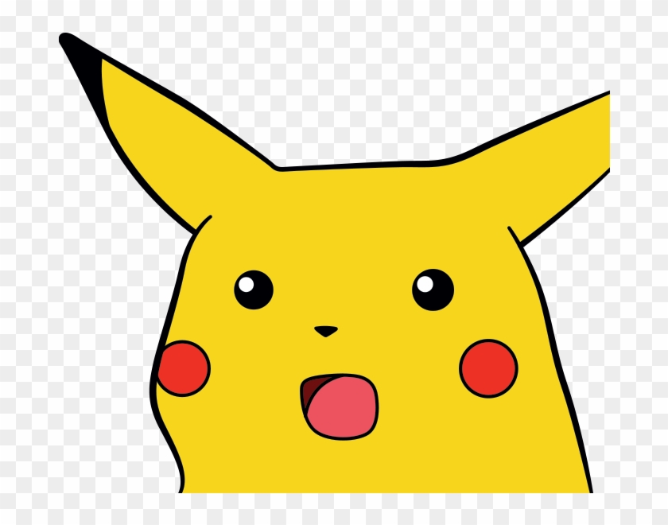
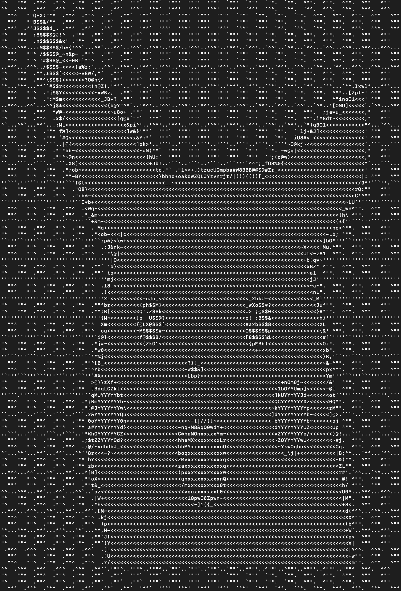

Python program that converts an input image into ascii art.

It does so by taking the input image, loading it into memory using opencv, setting it to grayscale, and normalizing it within the range of all ascii characters. It then maps the individual pixel values of the modified image to an array of ascii characters sorted from decreasing to increasing intensity.

The output text image is then printed to the screen and saved to disk.
 
To run:
python3 imageToAscii.py -i \<path-to-input-image\> -o \<save-path-for-text-file\>

Before:

After:

